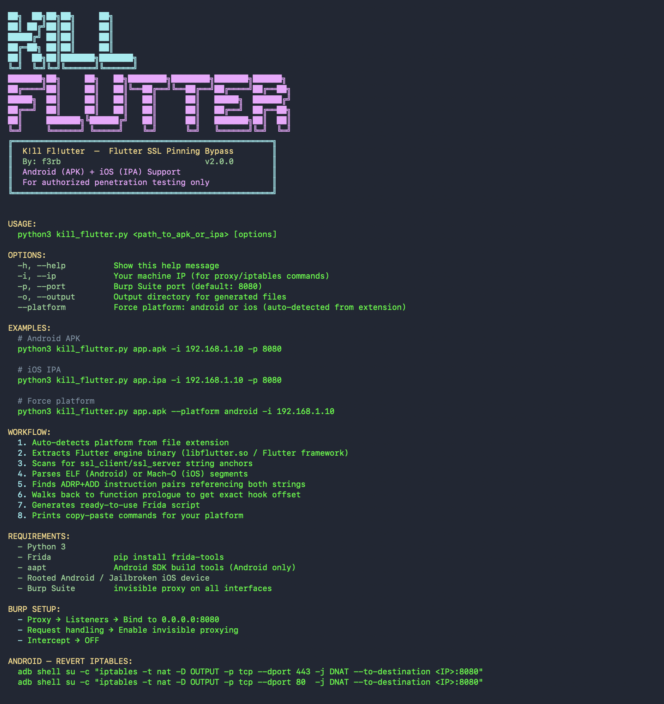

# K!ll Fl!utter 🔪



> **Flutter SSL Pinning Bypass — Android & iOS**
> By [f3rb](https://github.com/f3rb)
> For authorized penetration testing only

---

## The Story

A few months back, on a routine Flutter app pentest, the usual SSL pinning bypasses all failed — the common Frida scripts and reFlutter, nothing got traffic into Burp. That sent me down a rabbit hole into *why* Flutter is so resistant to interception, and this tool is the result.

---

## Why Flutter Is Different

Flutter doesn't use the phone's normal network stack. It ships its own networking engine (BoringSSL) compiled into a native file — `libflutter.so` on Android, the `Flutter` framework on iOS. All certificate checking happens inside that compiled file.

That's also why OS-level bypasses like **Objection** and **SSL Kill Switch** don't help — they hook the system trust APIs, which Flutter never calls. It goes straight to BoringSSL inside its own engine.

So on Flutter you're left with two real options — and on modern builds, both were failing.

---

## Why the Usual Tools Fail

### Public Frida scripts
These hook the certificate-check function at a **hardcoded offset**, worked out by reverse-engineering one specific version of the Flutter engine. The problem: that offset is different in every build. Flutter releases constantly, and each engine version compiles differently, so the function moves to a new address each time. A script written for an older version points at the wrong location, matches nothing, and the hook never lands. The script didn't break — the binary moved under it.

### reFlutter
For a long time this was the go-to Flutter tool, and it genuinely worked. It reads a snapshot hash from the app, matches it against a table of known Flutter engine versions, then recompiles a patched engine to swap in. But that table has to be manually updated for each Flutter release and has fallen behind — on newer builds the hash isn't recognised and it reports the engine as unsupported.

### The common thread
Both tools are pinned to a specific Flutter version — one through a hardcoded offset, the other through a lookup table. Flutter ships faster than either keeps up, so both decay over time and fail on current apps.

---

## The Deeper Problem

The engine binary is stripped — no function names, no labels. Finding the certificate-check function the manual way means hours in Ghidra or IDA, and because the offset changes every version, you'd have to redo it for every new build.

---

## How K!ll Fl!utter Works Differently

Instead of a hardcoded offset or a version table, it finds the function **fresh in each binary** using properties that stay constant across every Flutter version:

1. **String anchors** — BoringSSL's verification function always references two fixed strings, `ssl_client` and `ssl_server`. These are baked into BoringSSL's own source and exist in every Flutter binary ever compiled.

2. **ADRP+ADD instruction scan** — ARM64 always loads string addresses using `ADRP+ADD` instruction pairs. This is an architecture-level constant, not a Flutter-specific pattern. Scanning for these pairs pointing at the anchor strings locates the function body.

3. **Prologue walkback** — ARM64 functions always begin with a stack-setup instruction (`STP x29,x30` or `SUB sp`). Walking backward from the anchors to that instruction gives the exact function start.

From these it calculates the exact **offset** of the certificate-check function in that specific binary. Because it recalculates the offset every time, the Frida hook lands precisely on any build — **no manual reverse engineering, no Ghidra, no version table, nothing to keep updating.**

```
APK / IPA
  └── Extract Flutter engine binary (libflutter.so / Flutter framework)
       └── Find ssl_client + ssl_server string anchors
            └── Scan ADRP+ADD instruction pairs referencing both
                 └── Walk back to ARM64 function prologue
                      └── Offset calculated → Frida script generated
                           └── iptables redirect → traffic hits Burp
```

---

## The Flow

1. Point it at an APK or IPA
2. It extracts the Flutter engine file
3. It finds the certificate-check function and calculates its offset
4. It generates a ready-to-use Frida script that forces the check to pass
5. It prints the exact commands to route traffic to your proxy (Flutter ignores proxy settings, so it uses kernel-level redirection)

Point it at an app, get back a working Frida script and copy-paste commands.


---

## What Pinning It Bypasses

✅ Default Flutter `HttpClient` (dart:io) certificate validation
✅ `dio` package SSL pinning
✅ Custom certificate validators built on Flutter's HTTP stack
✅ Any pinning that ultimately calls `ssl_crypto_x509_session_verify_cert_chain`

❌ mTLS / client certificate pinning (server requires a client cert)
❌ Native Android/iOS certificate pinning outside Flutter
❌ Root / jailbreak detection (separate problem)

---

## Requirements

| Requirement | Notes |
|---|---|
| Python 3 | Any recent version |
| `frida-tools` | `pip install frida-tools` |
| `aapt` | Android SDK build tools (Android only, for package name detection) |
| Rooted Android **or** Jailbroken iOS | Required for Frida + iptables |
| Burp Suite | Community or Pro |

---

## Installation

```bash
git clone https://github.com/f3rb/kill_flutter
cd kill_flutter
pip install frida-tools
```

---

## Usage

```bash
# Help
python3 kill_flutter.py -h

# Android APK
python3 kill_flutter.py app.apk -i 192.168.1.10 -p 8080

# iOS IPA
python3 kill_flutter.py app.ipa -i 192.168.1.10 -p 8080 --device-ip 192.168.1.50

# Custom output directory
python3 kill_flutter.py app.apk -i 192.168.1.10 -o /tmp/pentest

# Force platform (if extension is ambiguous)
python3 kill_flutter.py app.apk --platform android -i 192.168.1.10
```

---

## Options

| Flag | Description | Default |
|---|---|---|
| `app` | Path to APK or IPA | required |
| `-i, --ip` | Your machine IP address | `<YOUR_IP>` |
| `-p, --port` | Burp Suite listener port | `8080` |
| `-o, --output` | Output directory for generated files | App directory |
| `--platform` | Force platform: `android` or `ios` | auto-detected |
| `--device-ip` | iOS device IP for SSH iptables | `<DEVICE_IP>` |
| `-h, --help` | Show help | — |

> **Note:** the tool handles one platform per run, auto-detected from the file extension (`.apk` → Android, `.ipa` → iOS). For the same app on both platforms, run it twice — once per binary.

---

## Output

The tool generates everything needed in one run:

- `flutter_bypass.js` — ready-to-use Frida script with the offset baked in
- Copy-paste iptables commands (Android via adb / iOS via SSH)
- Copy-paste Frida launch command with the package name auto-filled

```
[*] Platform : ANDROID
[+] Package  : com.example.flutterapp
[+] ssl_client @ ['0x1a1d75']
[+] ssl_server @ ['0x1ab471']
[*] Scanning ADRP+ADD refs... (may take a moment)
[+] SSL verify offset: 0x740cc8
[+] Frida script saved: /path/to/flutter_bypass.js

[3] Launch Frida:
  frida -U -f com.example.flutterapp -l "/path/to/flutter_bypass.js"
```

---

## Burp Suite Setup

1. Proxy → Listeners → Add listener on port `8080`
2. Bind address → **All interfaces** (`0.0.0.0`)
3. Request handling → ✅ **Support invisible proxying**
4. Intercept → **Off**

---

## Revert

**Android:**
```bash
adb shell su -c "iptables -t nat -D OUTPUT -p tcp --dport 443 -j DNAT --to-destination <IP>:8080"
adb shell su -c "iptables -t nat -D OUTPUT -p tcp --dport 80  -j DNAT --to-destination <IP>:8080"
# or just:
adb reboot
```

**iOS:**
```bash
ssh root@<device-ip> "iptables -t nat -D OUTPUT -p tcp --dport 443 -j DNAT --to-destination <IP>:8080"
ssh root@<device-ip> "iptables -t nat -D OUTPUT -p tcp --dport 80  -j DNAT --to-destination <IP>:8080"
# or just reboot the device
```

---

## How It Finds the Function — Technical Detail

Flutter's engine binary is fully stripped. The function `ssl_crypto_x509_session_verify_cert_chain` cannot be found by name, so it's located by behaviour instead:

**String anchors** — BoringSSL source contains:
```c
const char *peer = SSL_is_server(ssl) ? "ssl_client" : "ssl_server";
```
These strings are unique to this function and present in every build. A byte scan finds their file offsets.

**Segment parsing** — ARM64 instructions encode virtual addresses, not file offsets. The tool parses the ELF (Android) or Mach-O (iOS) segment headers to build a file-offset ↔ virtual-address mapping so the instruction scan is correct.

**ADRP+ADD scan** — it scans the executable segment for `ADD` instructions whose immediate matches the low 12 bits of each string's virtual address, then verifies the preceding `ADRP` targets the correct 4 KB page. This locates the code that loads both strings.

**Prologue walkback** — from the co-located references, it walks backward to the first function-prologue instruction. That's the start of the verify function — the offset baked into the Frida script.

**The hook** — at runtime, ASLR randomizes the library base, but the offset is fixed. `module.base + offset` always resolves to the function:
```javascript
var addr = m.base.add(offset);
Interceptor.attach(addr, {
    onLeave: function(retval) {
        retval.replace(0x1);   // force verification success
    }
});
```

**Traffic redirect** — Flutter opens TCP connections directly, ignoring the system proxy, so kernel-level iptables DNAT redirects all outgoing 443/80 traffic to Burp regardless of the app's behaviour.

---

## References

- [PT Swarm — Fork Bomb for Flutter (reFlutter internals)](https://swarm.ptsecurity.com/fork-bomb-for-flutter/)
- [SensePost — Intercepting HTTPS in Flutter with Frida](https://sensepost.com/blog/2025/intercepting-https-communication-in-flutter-going-full-hardcore-mode-with-frida/)
- [NVISO — Intercepting Flutter Traffic](https://blog.nviso.eu/2022/08/18/intercept-flutter-traffic-on-ios-and-android-http-https-dio-pinning/)
- [reFlutter](https://github.com/ptswarm/reFlutter)
- [BoringSSL Source — ssl_x509.cc](https://github.com/google/boringssl/blob/master/ssl/ssl_x509.cc)

---

## Disclaimer

This tool is intended for **authorized security testing only**. Only use it on applications you have explicit written permission to test. The author is not responsible for any misuse or damage caused by this tool.

---

## Author

**f3rb** — Offensive Security | Mobile Pentesting | Tool Development
