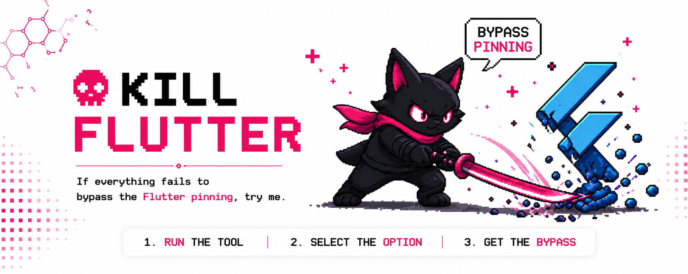

# K!ll Fl!utter 🔪



> **Flutter SSL Pinning Bypass Tool — Android & iOS**  
> By [f3rb123](https://github.com/f3rb123)  
> Multi-arch: `arm64-v8a` · `x86_64` · `armeabi-v7a`  
> For authorized penetration testing only

---

## The Problem

Flutter apps are notoriously difficult to intercept during penetration testing.
Unlike standard Android or iOS apps, Flutter bundles its own network stack —
**BoringSSL** — compiled directly into a native binary (`libflutter.so` on
Android, `Flutter.framework/Flutter` on iOS).

This means:

- ❌ Android Network Security Config is completely ignored
- ❌ Java-level SSL hooks (OkHttp, HttpURLConnection) don't exist
- ❌ iOS App Transport Security is bypassed
- ❌ System proxy settings are not respected
- ❌ Standard tools like Objection, SSL Kill Switch, and generic Frida scripts hook the wrong layer entirely

Even **reFlutter** — the most popular Flutter-specific bypass tool — relies on
a hardcoded database of known Flutter engine hashes. Any app built on a Flutter
version not in that database simply won't be patched correctly.

---

## The Solution
K!ll Fl!utter takes a fundamentally different approach. Instead of relying on
known patterns or version databases, it **derives the exact hook offset directly
from the binary itself**. The offset is found with version-agnostic techniques,
and — as of v3.0.0 — with an **architecture-aware engine** that decodes the
right machine code for whichever ABI you're targeting.

### 1. String Anchors (every arch)
Regardless of Flutter version, compiler, or CPU architecture, BoringSSL's SSL
verification function always references two strings: `ssl_client` and
`ssl_server`. This is hardcoded in BoringSSL's open source and will never
change. These strings act as permanent landmarks inside any Flutter binary.

### 2. Architecture-Aware Reference Scan
Different CPUs load a string's address in completely different ways, so the tool
detects the architecture from the binary's ELF/Mach-O header and routes to the
matching decoder:

| ABI | How string addresses are loaded | Engine |
|---|---|---|
| `arm64-v8a` / iOS arm64 | `ADRP + ADD` pair (fixed 4-byte instructions) | built-in, no dependencies |
| `x86_64` | RIP-relative `LEA` (single instruction, 32-bit displacement) | Capstone |
| `armeabi-v7a` | Thumb-2 `MOVW/MOVT + ADD Rd,PC`, or literal pool | Capstone |

By locating the instructions that reference **both** landmark strings, we pin
down the function body in any binary regardless of version.

### 3. Prologue Walkback (per arch)
Every function begins with an architecture-defined prologue — an ABI requirement
that never changes. Walking back from the landmark to that prologue yields the
function start:

- **arm64** → `STP x29,x30` or `SUB sp`
- **x86_64** → `endbr64` / `push rbp` (resolved via control-flow boundaries)
- **armeabi-v7a** → `PUSH {…, lr}`

Once the offset is found, a Frida script is generated that intercepts
`ssl_crypto_x509_session_verify_cert_chain` at runtime, forcing it to always
return success — making the app trust any certificate including Burp's.

Since Flutter ignores system proxy settings, **iptables DNAT rules** are used
to transparently redirect all TCP 443/80 traffic to Burp at the kernel level,
bypassing Flutter's direct connection behavior entirely.

```
APK/IPA
  └── Pick ABI (--arch, or auto-select arm64-v8a)
       └── Extract Flutter binary (libflutter_<arch>.so / Flutter.framework)
            └── Detect arch from ELF/Mach-O header → route to engine
                 └── Find ssl_client + ssl_server string anchors
                      └── Scan arch-specific string references (ADRP+ADD / LEA / MOVW+MOVT)
                           └── Walk back to the function prologue
                                └── Offset found → Frida script generated
                                     └── iptables DNAT → all traffic hits Burp ✓
```

---

## Architectures & Why It Matters

Android packages native libraries per ABI (`lib/arm64-v8a/`, `lib/x86_64/`,
`lib/armeabi-v7a/`, …), but **at runtime it maps only the one ABI matching the
device or emulator**. That means the offset must come from the *same* ABI you
will actually run Frida against:

| Target | ABI to use |
|---|---|
| Modern real phones | `arm64-v8a` |
| Older / budget real phones | `armeabi-v7a` |
| Intel/AMD emulators (AVD, Genymotion) | `x86_64` |
| Very old emulator images | `x86` *(detected but not statically resolved — use x86_64 or dynamic Frida)* |
| iOS device | `arm64` (automatic) |

Use `--list-arch` to see what a given APK actually ships, then pass `--arch` (or
let the tool default to `arm64-v8a`).

---

## Why Other Tools Fail

| Tool | Approach | Why It Fails |
|---|---|---|
| Objection / SSL Kill Switch | Hooks Java/ObjC SSL layer | Flutter doesn't use this layer |
| Generic Frida scripts | Hardcoded byte patterns | Patterns change with every Flutter version |
| reFlutter | Patches APK from hash database | Database doesn't cover new Flutter versions |
| **K!ll Fl!utter** | **Dynamic binary analysis, multi-arch** | **Works on any Flutter version, arm64 / x86_64 / armeabi-v7a** |

---

## What Pinning Does It Bypass?

✅ Default Flutter `HttpClient` (dart:io) certificate validation  
✅ `dio` package SSL pinning  
✅ Custom certificate validators built on Flutter's HTTP stack  
✅ Any pinning that ultimately calls `ssl_crypto_x509_session_verify_cert_chain`  

❌ mTLS / client certificate pinning (server requires a client cert)  
❌ Native Android/iOS certificate pinning outside Flutter  
❌ Root / jailbreak detection (separate problem)  

---

## Requirements

| Requirement | Notes |
|---|---|
| Python 3 | Any recent version |
| `frida-tools` | `pip install frida-tools` |
| `capstone` | `pip install capstone` — **only needed for `x86_64` and `armeabi-v7a`**. The `arm64-v8a` and iOS paths are dependency-free. |
| `aapt` | Android SDK build tools (Android only, for package name detection) |
| Rooted Android **or** Jailbroken iOS | Required for Frida + iptables |
| Burp Suite | Community or Pro |

---

## Installation

```bash
git clone https://github.com/f3rb123/kill_flutter
cd kill_flutter
pip install frida-tools
pip install capstone   # optional: only for x86_64 / armeabi-v7a targets
```

---

## Usage

```bash
# Help
python3 kill_flutter.py -h

# List the ABIs bundled in an APK
python3 kill_flutter.py app.apk --list-arch

# Android APK (defaults to arm64-v8a)
python3 kill_flutter.py app.apk -i 192.168.1.10 -p 8080

# Target an x86_64 emulator build
python3 kill_flutter.py app.apk --arch x86_64 -i 10.0.2.2 -p 8080

# Target a 32-bit device build
python3 kill_flutter.py app.apk --arch armeabi-v7a -i 192.168.1.10

# iOS IPA
python3 kill_flutter.py app.ipa -i 192.168.1.10 -p 8080 --device-ip 192.168.1.50

# Custom output directory
python3 kill_flutter.py app.apk -i 192.168.1.10 -o /tmp/pentest

# Force platform (if extension is ambiguous)
python3 kill_flutter.py app.apk --platform android -i 192.168.1.10
```


---

## Options

| Flag | Description | Default |
|---|---|---|
| `app` | Path to APK or IPA | required |
| `-i, --ip` | Your machine IP address | `<YOUR_IP>` |
| `-p, --port` | Burp Suite listener port | `8080` |
| `-o, --output` | Output directory for generated files | App directory |
| `--arch` | Android ABI to target: `arm64-v8a` · `x86_64` · `armeabi-v7a` · `x86` | auto-selected (`arm64-v8a` if present) |
| `--list-arch` | List the ABIs bundled in the APK and exit | — |
| `--platform` | Force platform: `android` or `ios` | auto-detected |
| `--device-ip` | iOS device IP for SSH iptables | `<DEVICE_IP>` |
| `-h, --help` | Show help | — |

---

## Output

The tool generates everything needed in one run:

- `libflutter_<arch>.so` — the extracted engine binary (named per ABI so multiple
  targets don't overwrite each other)
- `flutter_bypass.js` — Ready-to-use Frida script with offset baked in
- Copy-paste iptables commands (Android via adb / iOS via SSH)
- Copy-paste Frida launch command with package name auto-filled

```
[*] Platform : ANDROID
[+] Package  : com.example.flutterapp
[*] ABIs present in APK: arm64-v8a, armeabi-v7a, x86_64
[*] No --arch given, auto-selected: arm64-v8a
[+] Saved: /path/to/libflutter_arm64-v8a.so
[+] ssl_client @ ['0x1bb68a']
[+] ssl_server @ ['0x1c4cb0']
[*] Binary arch (from ELF header): arm64
[*] [arm64] Scanning ADRP+ADD refs... (may take a moment)
[+] [arm64] SSL verify offset (RVA): 0x73ee8c
[+] Frida script saved: /path/to/flutter_bypass.js

[1] Set iptables on device:
  adb shell su -c "iptables -t nat -A OUTPUT -p tcp --dport 443 -j DNAT --to-destination 192.168.1.10:8080"
  adb shell su -c "iptables -t nat -A OUTPUT -p tcp --dport 80  -j DNAT --to-destination 192.168.1.10:8080"

[2] Verify iptables rules:
  adb shell su -c "iptables -t nat -L OUTPUT --line-numbers"

[3] Launch Frida:
  frida -U -f com.example.flutterapp -l "/path/to/flutter_bypass.js"

[4] Revert iptables when done:
  adb shell su -c "iptables -t nat -D OUTPUT -p tcp --dport 443 -j DNAT --to-destination 192.168.1.10:8080"
  adb shell su -c "iptables -t nat -D OUTPUT -p tcp --dport 80  -j DNAT --to-destination 192.168.1.10:8080"
```

---

## Burp Suite Setup

1. Proxy → Listeners → Add listener on port `8080`
2. Bind address → **All interfaces** (`0.0.0.0`)
3. Request handling → ✅ **Support invisible proxying**
4. Intercept → **Off**

---

## Revert

**Android:**
```bash
adb shell su -c "iptables -t nat -D OUTPUT -p tcp --dport 443 -j DNAT --to-destination <IP>:8080"
adb shell su -c "iptables -t nat -D OUTPUT -p tcp --dport 80  -j DNAT --to-destination <IP>:8080"
# or just:
adb reboot
```

**iOS:**
```bash
ssh root@<device-ip> "iptables -t nat -D OUTPUT -p tcp --dport 443 -j DNAT --to-destination <IP>:8080"
ssh root@<device-ip> "iptables -t nat -D OUTPUT -p tcp --dport 80  -j DNAT --to-destination <IP>:8080"
# or just reboot the device
```

---

## How It Works — Technical Deep Dive

Flutter's `libflutter.so` / `Flutter.framework` is a fully stripped binary —
no symbols, no debug info. The SSL verification function
`ssl_crypto_x509_session_verify_cert_chain` cannot be found by name.

**Step 1 — String anchors:**  
BoringSSL source always has:
```c
const char *peer = SSL_is_server(ssl) ? "ssl_client" : "ssl_server";
```
These strings exist in every Flutter binary ever compiled. We find their
file offsets using a simple byte scan. This step is identical on every
architecture.

**Step 2 — Arch detection & segment parsing:**  
The ABI is read straight from the binary's header (`EI_CLASS` + `e_machine`
for ELF; the Mach-O header for iOS), so the correct decoder is chosen
automatically — the `--arch` flag only controls which library is *extracted*.
The tool then parses the executable segment (ELF64 for arm64/x86_64, **ELF32
for armeabi-v7a**, Mach-O `__TEXT` for iOS) to build a
file-offset ↔ virtual-address mapping.

**Step 3 — Architecture-specific reference scan:**  

- **arm64** — scan the executable segment for `ADD` instructions whose immediate
  matches the low 12 bits of a string's virtual address, then verify the
  preceding `ADRP` targets the correct 4 KB page.
- **x86_64** — disassemble with Capstone and find RIP-relative `LEA`
  instructions whose computed target (`next_insn + disp32`) is a landmark
  string. (x86-64 has no ADRP+ADD, and its instructions are variable-length, so
  a fixed-stride scan does not apply.)
- **armeabi-v7a** — disassemble Thumb-2 with Capstone, tracking `MOVW/MOVT`
  register loads followed by `ADD Rd, PC` (PIC address computation), with a
  literal-pool (`LDR Rd, [pc, #imm]`) fallback.

**Step 4 — Prologue walkback:**  
Walk backwards from the co-located string references to the first prologue
instruction for that ABI (`STP x29,x30` / `SUB sp` on arm64, `endbr64` /
`push rbp` on x86_64, `PUSH {…, lr}` on armeabi-v7a). That is the entry point of
`ssl_crypto_x509_session_verify_cert_chain` — the offset we bake into the Frida
script.

**Step 5 — Frida hook:**
```javascript
var addr = m.base.add(offset);  // ASLR base + fixed offset
Interceptor.attach(addr, {
    onLeave: function(retval) {
        retval.replace(0x1);    // always return success
    }
});
```
The Frida module name is `libflutter.so` on **every** Android ABI (and `Flutter`
on iOS), so the same hook works regardless of which arch produced the offset.

**Step 6 — iptables redirect:**  
Flutter opens TCP connections directly, ignoring system proxy.
Kernel-level DNAT intercepts all outgoing 443/80 traffic and
redirects to Burp regardless of what the app does.

---

## References

- [NVISO — Intercepting Flutter Traffic](https://blog.nviso.eu/2022/08/18/intercept-flutter-traffic-on-ios-and-android-http-https-dio-pinning/)
- [MindedSecurity — Bypassing Certificate Pinning on Flutter](https://blog.mindedsecurity.com/2024/05/bypassing-certificate-pinning-on.html)
- [reFlutter](https://github.com/ptswarm/reFlutter)
- [BoringSSL Source — ssl_x509.cc](https://github.com/google/boringssl/blob/master/ssl/ssl_x509.cc)
- [Capstone Disassembly Engine](https://www.capstone-engine.org/)

---

## Disclaimer

This tool is intended for **authorized security testing only**.  
Only use on applications you have explicit written permission to test.  
The author is not responsible for any misuse or damage caused by this tool.

---

## Author

**f3rb123** — Offensive Security | Mobile Pentesting | Tool Development
